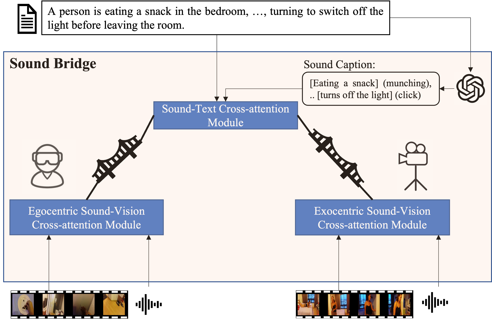

# **Sound Bridge：Associating Egocentric and Exocentric videos via Audio Cues**<br>

Official Pytorch Implementation of 'Sound Bridge：Associating Egocentric and Exocentric videos via Audio Cues'
<p align="center"></p>

## 📢 News


**[2025.2.28]** The repository is created.

<a name="installation"></a>
## Installation
1. Clone the repository from GitHub.

```shell
git clone https://github.com/shhuangcoder/SoundBridge.git
cd SoundBridge
```

2. Create conda environment.

```shell
conda create -n SoundBridge python=3.8
conda activate SoundBridge
```


3. Download the packages
```shell
pip install -r requirements.txt
```
<a name="dataset"></a>

## Dataset
For the dataset, we provide the corresponding download link. Please follow the download instructions provided in the link to download the dataset.<br>
EgoExoLearn: https://github.com/OpenGVLab/EgoExoLearn<br>
CharadesEgo: https://prior.allenai.org/projects/charades-ego<br>
You need to first extract the audio file (.wav) from the video and then use the BEATs model for audio feature extraction. Please acquire the BEATs model according to its requirements. [BEATS](https://github.com/microsoft/unilm.git)

### The prepared dataset should be in the following structure.
```
.
├── SoundBridge
│   ├── model
│   └── data
│   └── results
│   └── config
│   └── annotations
│   └── utils
│   └── function
├── datasets
│   └── Charades_Ego
│   │   └── videos
│   │   └── audios
│   │   └── audios_features
│   └── EgoExoLearn
│   │   └── videos
│   │   └── audios
│   │   └── audios_features
├── ckpt
│   └── Cha.pth
│   └── EgoExo.pth
│   └── clip_openai_timesformer_base.narrator_rephraser.ep_0001.md5sum_02dbb9.pth
├──README.md
└── ···
```
<a name="training"></a>

## Association

```
Download the Ego4d-pretrained [checkpoint](https://dl.fbaipublicfiles.com/lavila/checkpoints/dual_encoders/ego4d/clip_openai_timesformer_base.narrator_rephraser.ep_0001.md5sum_02dbb9.pth) from [LaViLA](https://github.com/facebookresearch/LaViLa), modify the config file (e.g. ./configs/train_egoonly.yml)
resume: /path/to/your/pretrained_checkpoint/
train: python -m torch.distributed.launch --nproc_per_node=NUM_GPU main_association.py --config ./configs/train_egoexo.yml
test: python main_association.py --config ./configs/test.yml
```

<a name="evaluation"></a>

## Retrieval

```
train: python -m torch.distributed.launch --nproc_per_node=NUM_GPU main_retrieval.py --config ./configs/train_egoexo.yml
test: python main_retrieval.py --config ./configs/test.yml
```


## Model Zoo
* You can download LLaMA from [huggingface](https://huggingface.co/meta-llama/Meta-Llama-3-8B) to generate the required audio description text based on the original video description.
* You can download from [huggingface](https://huggingface.co/Sihong/SoundBridge) to test the model's performance.

## Citation
If you find the repository or the paper useful, please use the following entry for citation.
```
@inproceedings{
xxx2025yyy,
title={Sound Bridge：Associating Egocentric and Exocentric videos via Audio Cues},
author={Sihong Huang,Jiaxin Wu,Xiaoyong Wei,Yi Cai,Dongmei Jiang,Yaowei Wang},
booktitle={CVPR2025},
year={2025},
url={https://arxiv.org/}
}
```

## Acknowledgement

The codebase is based on [EgoExoLearn](https://github.com/OpenGVLab/EgoExoLearn/tree/main).
We thank the authors for their efforts.

